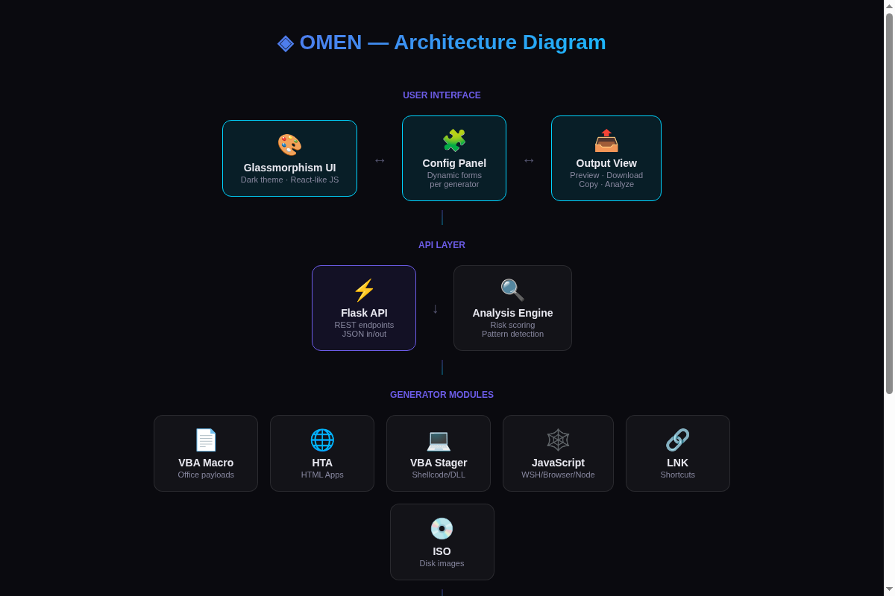
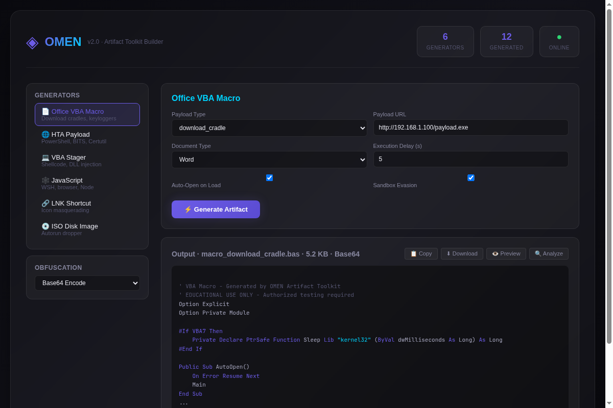

# ◈ OMEN — Artifact Toolkit Builder

```
 ██████╗ ███╗   ███╗███████╗███╗   ██╗
██╔═══██╗████╗ ████║██╔════╝████╗  ██║
██║   ██║██╔████╔██║█████╗  ██╔██╗ ██║
██║   ██║██║╚██╔╝██║██╔══╝  ██║╚██╗██║
╚██████╔╝██║ ╚═╝ ██║███████╗██║ ╚████║
 ╚═════╝ ╚═╝     ╚═╝╚══════╝╚═╝  ╚═══╝
```
*Copyright (c) 2025 Adam-ZS — https://github.com/Adam-ZS*

[]()
[]()
[]()
[]()

**OMEN** is a web-based artifact toolkit builder designed for authorized security assessments. It provides a clean glassmorphism dark UI for rapidly generating malicious documents, payloads, and delivery mechanisms with configurable obfuscation levels.

Built for red teams, penetration testers, and security researchers who need a unified interface for payload generation without switching between a dozen different tools.

---

## ⚠️ Legal Disclaimer

> **This tool is for authorized security testing and educational purposes ONLY.**
>
> Unauthorized access to computer systems is illegal. The developers assume no liability
> and are not responsible for any misuse or damage caused by this program.
>
> **You must have explicit written permission** before testing any system you do not own
> or have been authorized to test. By using this software, you agree to use it only for
> legal purposes in accordance with all applicable laws.

---

## ✨ Features

### Generator Modules
- 📄 **Office VBA Macro** — Download cradles, keyloggers, droppers, reverse shells, credential phishers, persistence (AutoOpen/Workbook_Open)
- 🌐 **HTA Payload** — HTML Applications with PowerShell, BITSAdmin, Certutil, XMLHTTP, or WScript droppers; fallback chain and sandbox evasion
- 💻 **VBA Stager** — Shellcode loaders, DLL injection, process hollowing, WinHTTP download stagers with full Win32 API declarations
- 🕸 **JavaScript Payload** — WSH, browser, or Node.js targets; download cradles, reverse HTTP beacons, keyloggers, WMI persistence, screen capture, clipboard monitoring
- 🔗 **LNK Shortcut** — Malicious shortcut files with icon masquerading (PDF, folder, document, Chrome), hotkey triggers, and hidden execution
- 💿 **ISO Disk Image** — PowerShell scripts to build ISO images with embedded droppers, autorun.inf support, fake document names

### Obfuscation Engine
- 🔒 **Base64** — Simple encoding
- 🔐 **XOR** — Key-based XOR obfuscation with runtime decryption
- 🛡 **AES-256** — Full AES encryption wrapper
- 🔥 **Full Multi-Layer** — Combined obfuscation with junk code injection and variable randomization

### Web Dashboard
- 🎨 **Glassmorphism Dark UI** — Modern, responsive interface with glass cards
- ⚡ **Live Preview** — See generated artifacts before downloading
- 📊 **Risk Analysis** — Static analysis with detection risk scoring
- 📦 **Batch Downloads** — Generate multiple artifact types in one ZIP
- 🔍 **Copy to Clipboard** — One-click copy for quick use
- ⌨ **Keyboard Shortcuts** — Ctrl+Enter to generate, Ctrl+D to download

---

## 🚀 Quick Start

### Installation

```bash
# Clone the repository
git clone https://github.com/Adam-ZS/OMEN.git
cd OMEN

# Install dependencies
pip install -r requirements.txt

# Run the server
python app.py
```

Open your browser to `http://localhost:5000` and you're ready.

### Docker

```bash
docker build -t omen-toolkit .
docker run -p 5000:5000 omen-toolkit
```

---

## 🏗 Architecture



> **Dashboard Preview:**
> 

```
┌──────────────────────────────────────────────────────────┐
│                    OMEN Web Server                        │
│  ┌────────────┐  ┌──────────────┐  ┌──────────────────┐  │
│  │ Generator   │  │ Obfuscation  │  │ Analysis Engine  │  │
│  │ Modules     │──▶ Engine       │──▶ (Risk Scoring)   │  │
│  └────────────┘  └──────────────┘  └──────────────────┘  │
│         │                                                 │
│         ▼                                                 │
│  ┌──────────────────────────────────────────────────┐     │
│  │              API Layer (REST JSON)                │     │
│  │  /api/generators  /api/generate  /api/download    │     │
│  │  /api/preview     /api/analyze   /api/obfuscate   │     │
│  └──────────────────────────────────────────────────┘     │
└──────────────────────────────────────────────────────────┘
         │
         ▼
┌──────────────────────────────────────────────────────────┐
│              Glassmorphism Dark Web UI                    │
│  ┌──────────┐  ┌──────────────────┐  ┌───────────────┐  │
│  │ Generator │  │ Config Panel     │  │ Output /      │  │
│  │ Sidebar   │  │ (Dynamic Forms)  │  │ Preview Pane  │  │
│  └──────────┘  └──────────────────┘  └───────────────┘  │
└──────────────────────────────────────────────────────────┘
```

---

## 📖 Usage

### Web Interface

1. **Select a generator** from the sidebar (Macro, HTA, VBA, JS, LNK, ISO)
2. **Configure options** — each generator has its own form with relevant parameters (URLs, target process, obfuscation settings)
3. **Set obfuscation level** — from None to Full multi-layer obfuscation
4. **Click "Generate Artifact"** — the output appears in the preview pane
5. **Download, copy, or analyze** — use the action buttons

### API

All generators are accessible via REST API:

```bash
# List available generators
curl http://localhost:5000/api/generators

# Generate an artifact
curl -X POST http://localhost:5000/api/generate \
  -H "Content-Type: application/json" \
  -d '{
    "generator": "macro",
    "options": {
      "payload_type": "download_cradle",
      "url": "http://YOUR_SERVER/payload.exe",
      "auto_open": true,
      "sandbox_evasion": true
    },
    "obfuscation": "aes"
  }'

# Download a generated artifact
curl -X POST http://localhost:5000/api/download \
  -H "Content-Type: application/json" \
  -d '{"generator": "hta", "options": {"payload_url": "http://YOUR_SERVER/payload.exe"}}' \
  --output payload.hta

# Analyze artifact for detection risk
curl -X POST http://localhost:5000/api/analyze \
  -H "Content-Type: application/json" \
  -d '{"content": "your payload content here"}'

# Batch download multiple artifacts
curl -X POST http://localhost:5000/api/download/batch \
  -H "Content-Type: application/json" \
  -d '{"requests": [{"generator": "macro"}, {"generator": "hta"}]}' \
  --output artifacts.zip
```

---

## 🧩 Generator Modules

### Office VBA Macro
Downloads and executes payloads via MSXML2.XMLHTTP + ADODB.Stream, with AutoOpen/Workbook_Open triggers, sandbox evasion checks, and optional self-deletion.

### HTA Payload
HTML Applications that drop and execute payloads using PowerShell, BITSAdmin, Certutil, raw XMLHTTP, or WScript. Configurable fallback chain tries multiple methods.

### VBA Stager
Full Win32 API declarations for shellcode execution (VirtualAlloc + RtlMoveMemory + CreateThread), DLL injection (OpenProcess + VirtualAllocEx + WriteProcessMemory + CreateRemoteThread), and process hollowing.

### JavaScript Payload
Cross-runtime JS payloads for WSH (ActiveXObject), browser (DOM APIs), and Node.js (http/child_process modules). Supports reverse HTTP beacons with command execution.

### LNK Shortcut
VBScript-based .lnk shortcut creator with icon masquerading, hotkey triggers, and hidden execution. Masquerades as documents, folders, or system utilities.

### ISO Disk Image
PowerShell scripts that generate bootable ISO images with embedded droppers. Supports autorun.inf for AutoPlay execution on older Windows versions.

---

## 🔒 Obfuscation Levels

| Level | Method | Size Overhead | Detection Reduction |
|-------|--------|--------------|-------------------|
| None | Raw output | 0% | Baseline |
| Base64 | Standard encoding | ~33% | Low |
| XOR | Rolling key XOR + Base64 | ~40% | Medium |
| AES | AES-256 CBC encryption | ~50% | High |
| Full | Multi-layer + junk code + var randomization | ~80-120% | Very High |

---

## 🛡 OPSEC Considerations

1. **Never generate payloads on production networks** — use an isolated VM or air-gapped system
2. **Encrypt all C2 traffic** — HTTPS for communications, DNS over HTTPS for exfiltration
3. **Use redirectors** — never expose your C2 infrastructure directly
4. **Rotate payloads frequently** — static payloads get signatured quickly
5. **Test in your lab first** — verify detection rates before operations
6. **Clean up** — generated artifacts may be quarantined by local AV

---

## 📁 Project Structure

```
omen/
├── app.py                          # Flask web application
├── requirements.txt                # Python dependencies
├── generators/
│   ├── __init__.py                 # Base Generator class
│   ├── macro.py                    # Office VBA macro generator
│   ├── hta.py                      # HTA payload generator
│   ├── vba.py                      # VBA stager generator
│   ├── js_payload.py               # JavaScript payload generator
│   ├── lnk.py                      # LNK shortcut generator
│   └── iso.py                      # ISO disk image builder
├── static/
│   ├── css/
│   │   └── style.css              # Glassmorphism dark theme
│   └── js/
│       └── app.js                 # Frontend application logic
├── templates/
│   └── index.html                  # Main UI template
├── screenshots/
│   ├── architecture.png           # Architecture diagram
│   └── dashboard.png              # Dashboard screenshot
└── README.md                      # This file
```

---

## 📄 License

Copyright (c) 2025 **Adam-ZS** — https://github.com/Adam-ZS

**EDUCATIONAL USE ONLY** — See [LICENSE](LICENSE) for full terms.

Unauthorized access to computer systems is illegal. You must have explicit written permission before testing any system you do not own.

---

*Built with ◈ by [Adam-ZS](https://github.com/Adam-ZS) for authorized testing and education.*
